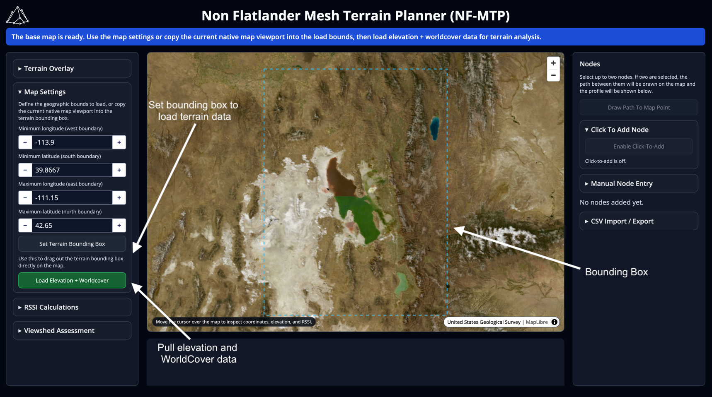
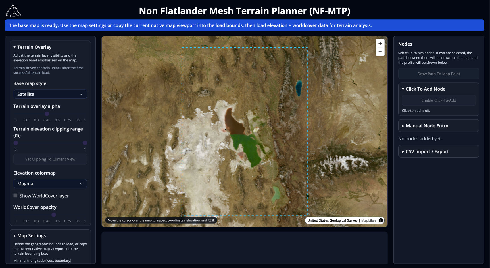
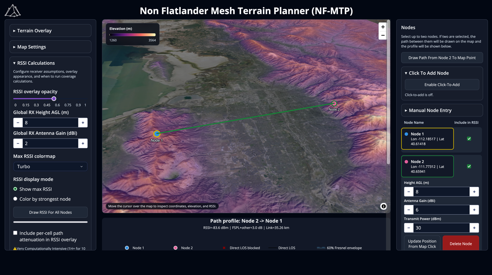
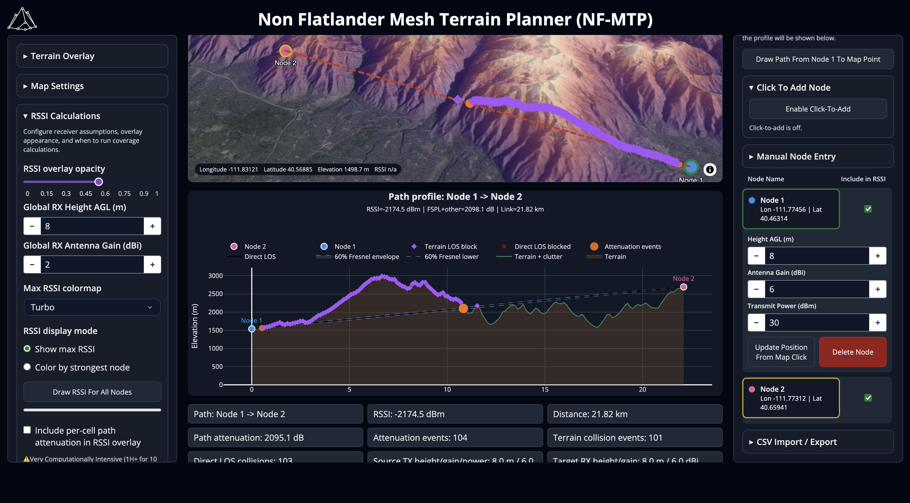
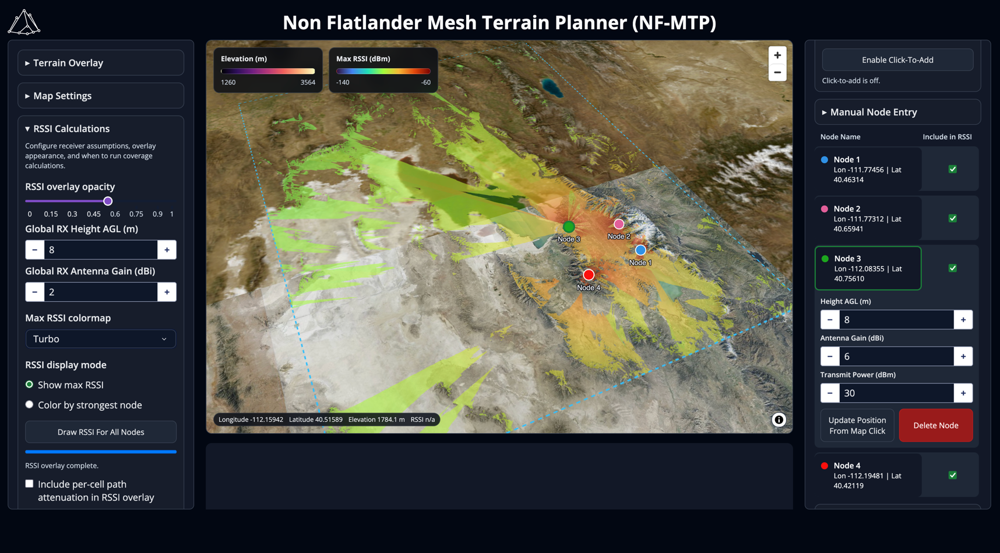
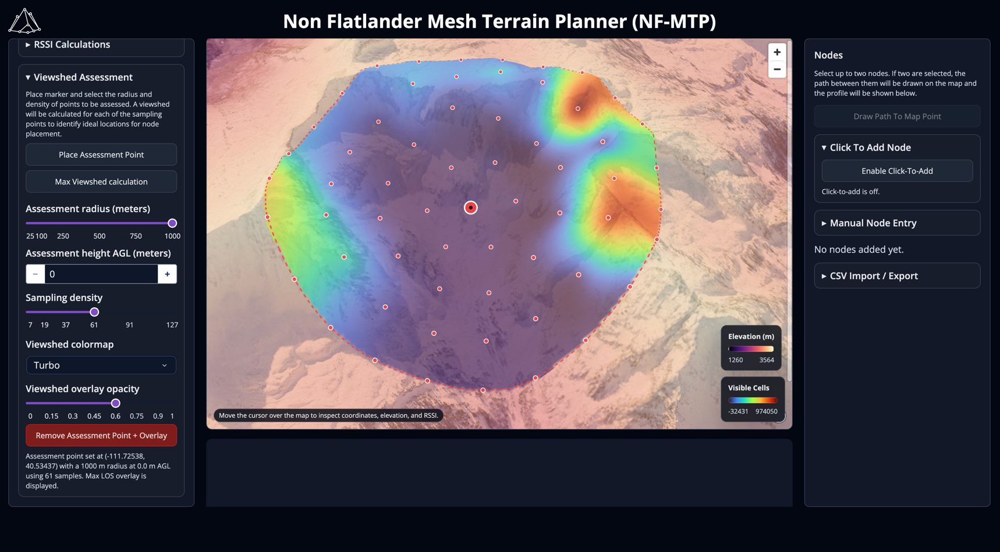

# Non Flatlander Mesh Terrain Planner (NF-MTP)
The Non Flatlander Mesh Terrain Planner (NF-MTP) is a Python-based application developed for the purposes of exporing and identifying suitable terrain for placing LoRa mesh nodes.

## Features:
- 3D terrain exploration
  - Satellite/Street map options 
  - Dynamic elevation visualization
  - Visualization of ground clutter via the ESA WorldCover dataset
- Node placement
  - Add nodes by clicking on map, entering coordinates, or uploading from CSV
  - Options for height, antenna gain, and transmit power
- Line of Sight analysis between nodes or map points
  - Identification of terrain obstruction or signal attenuation events using ESA Worldcover
- RSSI Predictions
  - Map of max RSSI from all placed nodes
  - Map which nodes provide the best coverage
  - Advanced RSSI calculations with ESA WorldCover Data
- Viewshed assessment
  - Identify what areas will provide the best coverage using viewshed sampling


## Installation
- This package was built and tested in Python 3.14
- I'd recommended using a python virtual environment to install dependencies and avoid conflicts
- I've not tested it on Windows yet (will soon) so if there are any issues please let me know

### MacOS/Linux
```
git clone https://github.com/lucasbinder/mesh_terrain.git
cd mesh_terrain
python3.14 -m venv meshterrain_venv
source meshterrain_venv/bin/activate
pip install -r requirements.txt
python app.py
```

### Windows
```
git clone https://github.com/lucasbinder/mesh_terrain.git
cd mesh_terrain
py -3.14 -m venv meshterrain_venv
meshterrain_venv\Scripts\activate.bat
pip install -r requirements.txt
python app.py
```
## Usage

### Loading Terrain

1. Select terrain area by entering coordinates or using `Set Terrain Bounding Box`
2. Click `Load Elevation + Worldcover` (This may take a minute)
   - You may be asked to allow notifications at this time, completely optional but may be helpful for letting you know when a longer simulation is complete
3. Terrain will be visible on the map when data is done loading

### Terrain Exploration and Navigation

#### Basic Navigation:
Single click to pan, scroll to zoom, and right click to rotate around terrain

#### Map Style
- Choose from either Satellite or Street map options

#### Visualizing and mapping elevation
- The opacity of the elevation overlay can be changed using `Terrain overlay alpha` to make underlying terrain more or less visible
- Use the `Terrain elevation clipping range (m)` slider to select the range of elevations you want to be colored
  - Useful for identifying the highest point on mountain or suitably high terrain
- You can additionally use `Set Clipping To Current View` to set the clipping range to the terrain currently in view
- Change the colormap used to visualize elevation with `Elevation colormap`

#### WorldCover
- WorldCover displays whether the type of material/structure/vegetation covering land
- You can turn on the WorldCover overlay using the `Show WorldCover layer` checkbox
- The opacity of the worldcover overlay can be selected with `WorldCover opacity`

### Adding Nodes

#### Adding Nodes
- Nodes can be added in one of three ways
  1. Pressing `Click To Add Node`, selecting a point on the map, and entering the node's name when prompted
  2. Entering the node's coordinates and name under `Manual Node Entry`
  3. Uploading a CSV containing the nodes' coordinates, names, height AGL, antenna gain, and transmit power
- Once added, nodes will be displayed on the map in their location

#### Editing Nodes
- Nodes can be selected by clicking the node on the map, or by selecting it in the sidebar
  - The primary selected node is denoted with a green outline, an additional selected node is outlined in yellow
- The primary selected node will display inputs on the sidebar:
  - `Height AGL (m)`: Change the height above ground level 
  - `Antenna Gain (dBi)`: Change antenna gain
  - `Transmit Power (dBm)`: Change transmit power
  - `Update Position From Map Click`: Update the Node's position by selecting a new point on the map
  - `Delete Node`: Self explanatory 

#### Saving Nodes
- All placed nodes can be exported as a CSV for later use under `CSV Import/Export -> Save Nodes CSV`

### Visualizing Line of Sight Path between Nodes

- When two nodes are selected, a path will be drawn between them on the map and a path profile graph beneath the map will become visible
- `Draw Path From Node To Map Point` will prompt you to select an arbitrary point on the map, a path profile will then be drawn between the primary selected node and that point
- On the main map: 
  - An unbroken green line indicates a viable connection while a dashed red line indicates one with terrain blockage or significant attenuation from clutter
  - Purple diamonds indicate locations where the line of sight is obstructed by terrain
  - Orange circles indicate locations predicted to have attenuation (by buildings, trees, etc.)
- On the Path profile map:
  - Cross-section terrain is displayed in brown, terrain plus clutter is indicated in green
  - The direct line of sight is drawn as a black line with the fresnel envelope shown as a dashed blue line around it
  - Line of sight blocks and attenuation events are marked as points
  - You can zoom into the map by dragging a selection box around the area of interest (and double clicking to zoom back out)
- Stats about the link are displayed below the graph

### RSSI Calculation and Visualization


#### Running Calculations
- With nodes added to the map, press `Draw RSSI For All Nodes` to perform RSSI calculations 
  - This may take a minute – if you enabled notifications, you will receive one when calculations are complete
- Set the RX Height AGL and RX Antenna Gain to test different receiver node profiles
- `Include per-cell path attenuation in RSSI overlay` will enable prediction of signal attenuation using the WorldCover dataset for all sheds included in a Node's viewshed

#### Visualization
- After calculating RSSI, the Max RSSI (default) will be displayed on the map
- Max RSSI is the max of the individual RSSI maps calculated for each node – essentially the maximum signal you could expect to get at any given point
- Selecting `Color by strongest node` will instead color the map by the color of the node providing the strongest signal to any given point, useful for assessing the contribution of different routers in overlapping areas
- The RSSI opacity and colormap can be selected using the slider or dropdown respectively
- In the nodes tab, you can deselect a node to hide it from showing up in RSSI calculations

### Viewshed Assessment

- The goal of placing infrastructure nodes is generally to maximize land coverage
  - While placing a node on the top of a mountain is ideal, sometimes constraints such as node visibility make this infeasible. In some cases, the top of the mountain may not even be the best place.
- The viewshed assessment tool is designed to granularly map out the best locations to place a node within an area of interst
- Use `Place Assessment Point` to select a point of interest
- `Assessment radius (meters)` can be used to select the search radius from the point of interest
- `Assessment height AGL (meters)` is used to set the height of the viewshed calculations – useful if the node you're planning to place will be elevated above the ground
- `Sampling Density` is used to set the number of sampled points within the selected radius (displayed as small red dots on the map). This is due to the computational-intensiveness of the viewshed calculations. Sampled points are interpolated using a radial basis function to create the displayed map. 
- The colormap and opacity of the viewshed assessment can be changed with `Viewshed colormap` and `Viewshed overlay opacity`